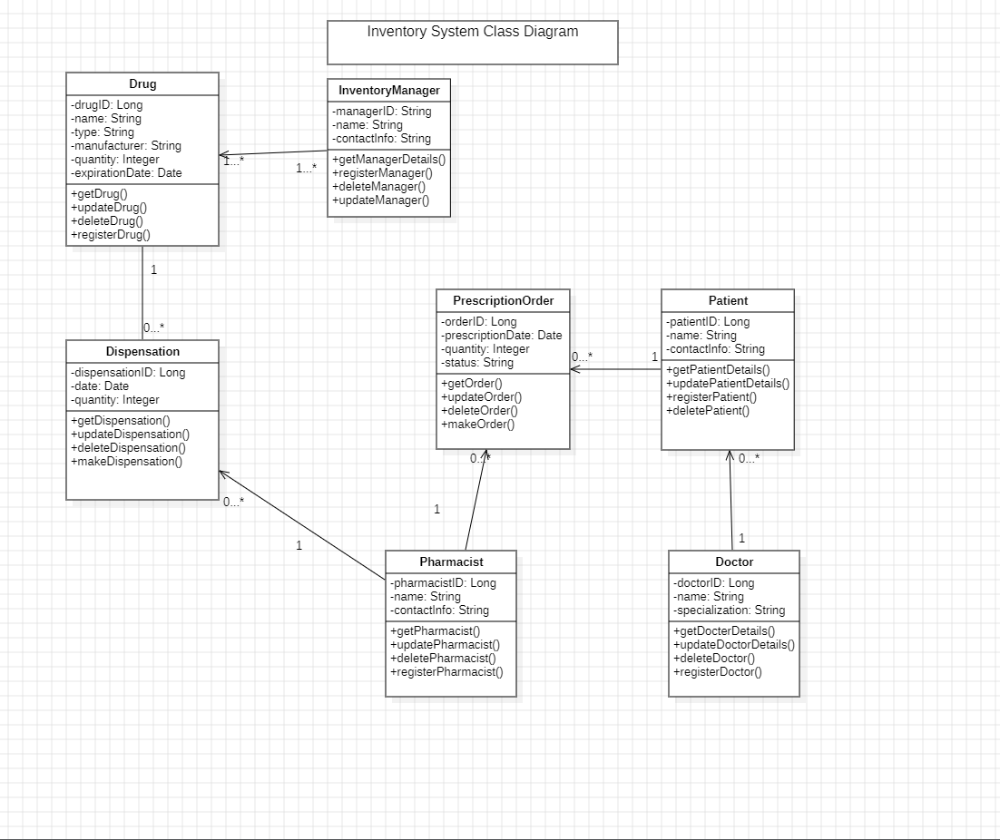
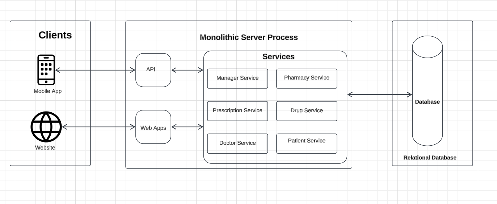

# (MRTS) Medical Record Tracking System Requirement

# Problem Statement/Description:
In today’s fast-paced world, individuals struggle to maintain a comprehensive and organized record of their medical history, including doctor visits, prescriptions, lab results, and other critical health information. This lack of organization often leads to missed appointments, forgotten medications, and difficulty in sharing medical information with healthcare providers.

To address these challenges, users require a web-based Medical Record Tracking System (MRTS) that allows them to securely store and manage their medical records. The system should enable users to schedule appointments, receive reminders for upcoming visits and medication, and easily share their medical history with their family doctors or other healthcare professionals when needed.
# Here’s a list of functional requirements based on the problem statement:

1. User Registration and Authentication
Secure user registration and login functionality.

2. Medical Record Management
Add, update, delete, and view medical records (doctor visits, prescriptions, lab results).

3. Secure sharing of medical history with doctors or family members.

4. Prescription Management
Track current and past prescriptions, including reminders for refills.

5. Lab Results Tracking.

Provide FAQs and contact support for technical assistance.
# UML Class Diagram

# Application Architecture
