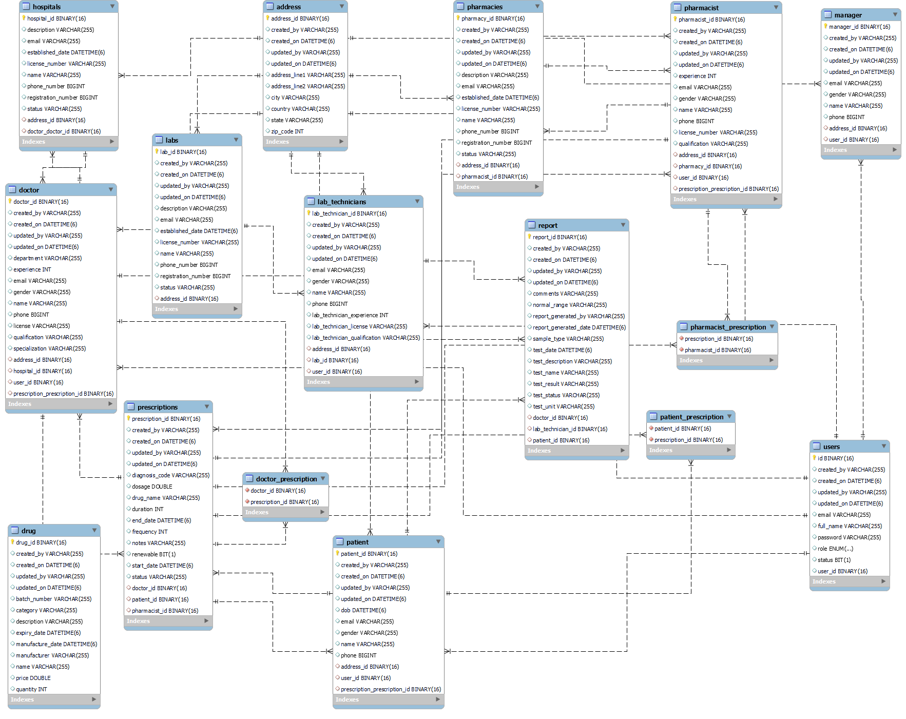
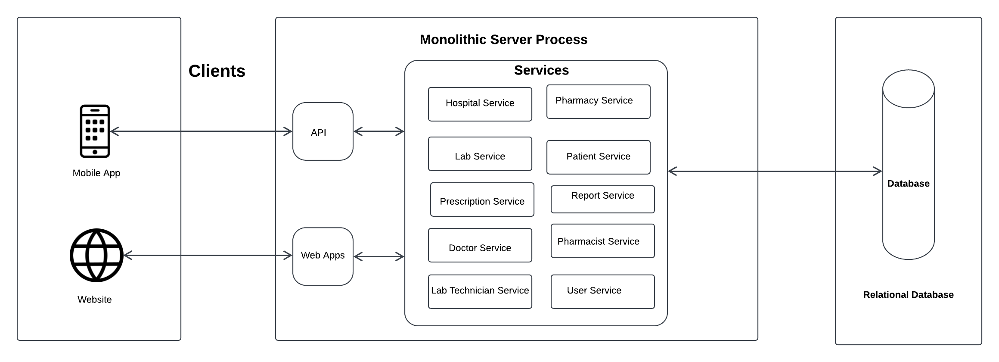

# (MRTS) Medical Record Tracking System Requirement

# Problem Statement/Description:

Nowadays, people face challenges in carrying and maintaining their health records. Individuals often struggle to keep a comprehensive and organized record of their medical history, including doctor prescriptions, lab results, and other critical health information.

To address these challenges, users require a web-based Medical Record Tracking System (MRTS) that allows them to securely store and manage their medical records. The system should enable users to store and retrieve their medical history easily, like track prescriptions and lab results.

# Here’s a list of functional requirements based on the problem statement:

1. User Registration and Authentication
Secure user registration and login functionality.

2. Register, update, delete, and view hospitals, pharmacies, and medical labs in the system by admin.

3. Provide register, update, delete, and view functionality for verified doctors records in the system. Also, Doctors should be able to view patients records and provide prescriptions.

4. Provide register, update, delete, and view functionality for verified lab technicians records in the system. Also, Lab technicians should be able to add lab test report. 

5. Provide register, update, delete, and view functionality for verified pharmacists records in the system. Also, Pharmacists should be able to view prescriptions and provide medicines.

6. Secure sharing of medical history with doctors.

7. Prescription Management
Track current and past prescriptions provided by verified doctors.

8. Lab Results Tracking.
Track and view lab report provide by verified Medical Lab technician.

# UML ERD Diagram


# Application Architecture


# source code 

# front end 
https://github.com/Gyanvlon/PMRTS.git

# back end
https://github.com/Gyanvlon/ASD-Project.git

# Technologies Used
- Frontend: HTML, CSS, TypeScript, Angular, Angular Material 
- Backend: Java, Spring Boot, Spring Security, Spring Data JPA, JUnit, Mockito, AOP, OpenAPI, Swagger, 
- Database: SQL, PostgreSQL
- Tools: Git, GitHub Actions, Docker, Postman, Intellij IDE, pgAdmin, VS code
- cloud services: Azure, web app service, Azure Database for PostgreSQL

# How to run the application
1. git clone https://github.com/Gyanvlon/PMRTS.git
3. cd PMRTS
4. npm install
5. open browser and go to http://localhost:4200
5. ng serve
6. git clone https://github.com/Gyanvlon/ASD-Project.git
6. cd ../ASD-Project
7. mvn spring-boot:run
8. open browser and go to http://localhost:8090/swagger-ui.html

# API End Points
1. User service 
 user types: ADMIN, DOCTOR, LAB_TECHNICIAN, PHARMACIST, PATIENT
- POST /api/v1/users/register
json data 
```json
{
  "userFullName": "test user",
  "userEmail": "test@admin.com",
  "userPassword": "test",
  "userStatus": true,
  "role": "DOCTOR"
}
```
- POST /api/v1/users/login
json data 
```json
{
  "userEmail": "test@admin.com",
  "userPassword": "test"
}
```
- GET /api/v1/users/{userId}
- PUT /api/v1/users/{userId}
```json
{
  "userFullName": "test user admin",
  "userEmail": "test@admin.com",
  "userPassword": "test",
  "userStatus": true,
  "role": "DOCTOR"
}
```
- PATCH /api/v1/users/{userId}
```json
{
  "userFullName": "test admin"
}
```
- DELETE /api/v1/users/{userId}
- GET /api/v1/users
- POST /api/v1/users/logout
- GET /api/v1/users/email/{email}

2. Hospital service
- POST /api/v1/hospitals
json data 
```json
{
  "hospitalName": "Community General Hospital",
  "hospitalDescription": "A state-of-the-art facility specializing in patient care and treatment.",
  "hospitalStatus": "Operational",
  "hospitalEstablishedDate": "2015-08-12",
  "hospitalRegistrationNumber": 123456789012,
  "hospitalLicenseNumber": "HOSP-LIC-2023-001",
  "hospitalEmail": "contact2@communitygeneral.com",
  "hospitalPhoneNumber": 9876543210,
  "hospitalAddress": {
    "addressLine1": "456 Elm Street",
    "city": "Metropolis",
    "state": "NY",
    "zipCode": "10001",
    "country": "USA"
  }
}
```
- GET /api/v1/hospitals/{hospitalId}
- PUT /api/v1/hospitals/{hospitalId}
```json
{
  "hospitalName": "Community General Hospital",
  "hospitalDescription": "A state-of-the-art facility specializing in patient care and treatment.",
  "hospitalStatus": "Operational and Research",
  "hospitalEstablishedDate": "2015-08-12",
  "hospitalRegistrationNumber": 123456789012,
  "hospitalLicenseNumber": "HOSP-LIC-2023-001",
  "hospitalEmail": "contact2@communitygeneral.com",
  "hospitalPhoneNumber": 9876543210,
  "hospitalAddress": {
    "addressLine1": "456 Elm Street",
    "city": "Metropolis",
    "state": "NY",
    "zipCode": "10001",
    "country": "USA"
  }
}
```
- PATCH /api/v1/hospitals/{hospitalId}
```json
{
  "hospitalName": "Community General Hospital",
  "hospitalPhoneNumber": 9876543210,
  "hospitalAddress": {
    "addressLine1": "456 new Street",
    "country": "USA"
  }
}
```
- DELETE /api/v1/hospitals/{hospitalId}
- GET /api/v1/hospitals
- GET /api/v1/hospitals/name/{name}
- GET /api/v1/hospitals/email/{email}

3. Pharmacy service
- POST /api/v1/pharmacies
```json
{
  "pharmacyName": "CityCare Pharmacy",
  "pharmacyDescription": "A trusted pharmacy providing a wide range of prescription and over-the-counter medicines.",
  "pharmacyEstablishedDate": "2010-05-20",
  "pharmacyStatus": "Active",
  "pharmacyEmail": "support160@citycarepharmacy.com",
  "pharmacyPhoneNumber": 9876543210,
  "registrationNumber": 123456789012,
  "licenseNumber": "LIC-12345-PH",
  "pharmacyAddress": {
    "addressLine1": "456 Elm Street",
    "city": "New York111",
    "state": "NY1112",
    "zipCode": "10001",
    "country": "USA  12"
  }
}

```
- GET /api/v1/pharmacies/{pharmacyId}
- PUT /api/v1/pharmacies/{pharmacyId}
```json
 {
"pharmacyName": "CityCare Pharmacy",
"pharmacyDescription": "A trusted pharmacy providing a wide range of prescription and over-the-counter medicines.",
"pharmacyEstablishedDate": "2010-05-20",
"pharmacyStatus": "Active",
"pharmacyEmail": "support160@citycarepharmacy.com",
"pharmacyPhoneNumber": 9876543210,
"registrationNumber": 123456789012,
"licenseNumber": "LIC-12345-PH",
"pharmacyAddress": {
"addressLine1": "456 Elm Street",
"city": "New York111",
"state": "NY1112",
"zipCode": "10001",
"country": "USA  12"
 }
}

```
- PATCH /api/v1/pharmacies/{pharmacyId}
```json
{
  "pharmacyName": "CityCare Pharmacy",
  "licenseNumber": "LIC-12345-PH",
  "pharmacyAddress": {
    "addressLine1": "456 Elm Street",
    "country": "USA"
  }
}
```
- DELETE /api/v1/pharmacies/{pharmacyId}
- GET /api/v1/pharmacies
- GET /api/v1/pharmacies/name/{name}
- GET /api/v1/pharmacies/email/{email}

4. Lab service
- POST /api/v1/labs
```json
{
"labName": "ABC Diagnostics",
"labDescription": "A state-of-the-art diagnostic lab providing a wide range of medical tests.",
"labStatus": "Active",
"labEstablishedDate": "2015-06-15",
"labRegistrationNumber": 123456789012,
"labLicenseNumber": "LIC-987654321",
"labEmail": "contact1@abcdiagnostics.com",
"labPhoneNumber": 1234567890,
"labAddress": {
"addressLine1": "123 Main Street",
"city": "Los Angeles",
"state": "CA",
"zipCode": "90001",
"country": "USA"
}
}
```
- GET /api/v1/labs/{labId}
- PUT /api/v1/labs/{labId}
```json
{
  "labName": "ABC Diagnostics",
  "labDescription": "A state-of-the-art diagnostic lab providing a wide range of medical tests.",
  "labStatus": "Active",
  "labEstablishedDate": "2015-06-15",
  "labRegistrationNumber": 123456789012,
  "labLicenseNumber": "LIC-987654321",
  "labEmail": "contact1@abcdiagnostics.com",
  "labPhoneNumber": 1234567890,
  "labAddress": {
    "addressLine1": "123 Main Street",
    "city": "Los Angeles",
    "state": "CA",
    "zipCode": "90001",
    "country": "USA"
  }
}
```
- PATCH /api/v1/labs/{labId}
```json
{
  "labName": "ABC Diagnostics",
  "labDescription": "A state-of-the-art diagnostic lab providing a wide range of medical tests.",
  "labStatus": "Active",
  "labAddress": {
    "addressLine1": "123 Main Street",
    "city": "Los Angeles"
  }
}
```
- DELETE /api/v1/labs/{labId}
- GET /api/v1/labs
- GET /api/v1/labs/name/{name}
- GET /api/v1/labs/email/{email}

5. Doctor service
- GET /api/v1/doctors/{doctorId}
- PUT /api/v1/doctors/{doctorId}
```json
{
  "doctorName": "John Doe",
  "doctorEmail": "test@gmail.com",
  "doctorPhone": 3456789012,
  "doctorGender": "female",
  "doctorSpecialization": "Cardiology",
  "doctorExperience": 5,
  "doctorDepartment":"opd",
  "doctorLicense":"ST123",
  "doctorQualification":"Phd",
  "hospitalId":"6078ac5e-3724-46ca-9160-941fbc6b5016",
  "doctorAddress":{
    "addressLine1": "123 Main St",
    "addressLine2": "Suite 101",
    "city": "New York",
    "state": "NY",
    "country": "USA",
    "zipCode": 10001
  }
}
```
- PATCH /api/v1/doctors/{doctorId}
```json
{
  "doctorName": "John Doe",
  "doctorExperience": 5,
  "doctorDepartment":"opd",
  "doctorLicense":"ST123",
  "doctorQualification":"Phd",
  "doctorAddress":{
    "addressLine1": "123 Main St",
    "zipCode": 10001
  }
}
```
- DELETE /api/v1/doctors/{doctorId}
- GET /api/v1/doctors
- GET /api/v1/doctors/name/{name}
- GET /api/v1/doctors/email/{email}

7. Lab Technician service
- GET /api/v1/labtechnicians/{labTechnicianId}
- PUT /api/v1/labtechnicians/{labTechnicianId}
```json
{
  "labTechnicianName": "John Doe",
  "labTechnicianEmail": "johndoe@example.com",
  "labTechnicianPhone": 1234567890,
  "labTechnicianGender": "Male",
  "labTechnicianQualification": "B.Sc. in Biology",
  "labTechnicianExperience": 5,
  "labTechnicianLicense": "1234567890",
  "labId": "d38fca87-cafa-4c33-99d3-fc9e08668c28",
  "labTechnicianAddress": {
    "addressLine1": "123 Main Street",
    "addressLine2": "Apt 4B",
    "city": "Anytown",
    "state": "CA",
    "zipCode": "12345",
    "country": "USA"
  }
}


```
- PATCH /api/v1/labtechnicians/{labTechnicianId}
```json
{
  "labTechnicianName": "John Doe",
  "labTechnicianEmail": "johndoe@example.com",
  "labTechnicianPhone": 1234567890,
  "labTechnicianAddress": {
    "state": "CA",
    "zipCode": "12345",
    "country": "USA"
  }
}


```
- DELETE /api/v1/labtechnicians/{labTechnicianId}
- GET /api/v1/labtechnicians
- GET /api/v1/labtechnicians/name/{name}
- GET /api/v1/labtechnicians/email/{email}

8. Pharmacist service
- GET /api/v1/pharmacists/{pharmacistId}
- PUT /api/v1/pharmacists/{pharmacistId}
```json
{
  "pharmacistName": "John Doe",
  "pharmacistEmail": "johndoe@example.com",
  "pharmacistPhone": "1234567890",
  "pharmacistGender": "Male",
  "pharmacistLicense":"AB123",
  "pharmacistExperience":3,
  "pharmacistQualification":"PHD",
  "pharmacyId":"9da3110a-761f-4ad3-9bfe-50a8286a82aa",
  "pharmacistAddress": {
    "addressLine1": "123 Main St",
    "addressLine2": "Apt 4B",
    "city": "Springfield",
    "state": "IL",
    "zipCode": "62701",
    "country": "USA"
  }
}
```
- PATCH /api/v1/pharmacists/{pharmacistId}
```json
{
  "pharmacistName": "John Doe",
  "pharmacistExperience":3,
  "pharmacistQualification":"PHD",
  "pharmacyId":"9da3110a-761f-4ad3-9bfe-50a8286a82aa",
  "pharmacistAddress": {
    "state": "IL",
    "zipCode": "62701",
    "country": "USA"
  }
}
```
- DELETE /api/v1/pharmacists/{pharmacistId}
- GET /api/v1/pharmacists
- GET /api/v1/pharmacists/name/{name}
- GET /api/v1/pharmacists/email/{email}

9. Patient service
- GET /api/v1/patients/{patientId}
- PUT /api/v1/patients/{patientId}
```json
{
  "patientName": "Jane Smith",
  "patientEmail": "janesmith@example.com",
  "patientPhone": "9876543210",
  "patientGender": "male",
  "patientDob": "1990-05-15",
  "patientAddress": {
    "addressLine1": "123 Main St",
    "addressLine2": "Apt 4B",
    "city": "Springfield",
    "state": "New York",
    "zipCode": "62701",
    "country": "USA"
  }
}
```
- PATCH /api/v1/patients/{patientId}
```json
{
  "patientName": "Jane Smith",
  "patientAddress": {
    "addressLine1": "123 Main St",
    "country": "USA"
  }
}
```
- DELETE /api/v1/patients/{patientId}
- GET /api/v1/patients
- GET /api/v1/patients/name/{name}
- GET /api/v1/patients/email/{email}

10. Prescription service
- POST /api/v1/prescriptions
```json
{
  "drugName": "Drug Name",
  "dosage": 10.0,
  "duration": 7,
  "frequency": 2,
  "startDate": "2023-11-22",
  "endDate": "2023-11-29",
  "notes": "Additional notes for the prescription",
  "status": "Active",
  "diagnosisCode": "ICD10_CODE",
  "renewable": true,
  "patientId": "a1a1b444-6a1d-419b-a925-054da17938f4",
  "pharmacistId":"9d491c11-eb45-460b-98c8-e72d8e4a4dd8",
  "doctorId":"9f778ea6-7e47-4742-ab1d-7fadf664eb9e"
}
```
- GET /api/v1/prescriptions/{prescriptionId}
- PUT /api/v1/prescriptions/{prescriptionId}
```json
{
  "drugName": "Drug Name",
  "dosage": 10.0,
  "duration": 7,
  "frequency": 2,
  "startDate": "2023-11-22",
  "endDate": "2023-11-29",
  "notes": "Additional notes for the prescription",
  "status": "Active",
  "diagnosisCode": "ICD10_CODE",
  "renewable": true,
  "patientId": "a1a1b444-6a1d-419b-a925-054da17938f4",
  "pharmacistId":"9d491c11-eb45-460b-98c8-e72d8e4a4dd8",
  "doctorId":"9f778ea6-7e47-4742-ab1d-7fadf664eb9e"
}
```
- PATCH /api/v1/prescriptions/{prescriptionId}
```json
{
  "drugName": "Drug Name",
  "dosage": 10.0,
  "duration": 7,
  "frequency": 2
}
```
- DELETE /api/v1/prescriptions/{prescriptionId}
- GET /api/v1/prescriptions
- GET /api/v1/prescriptions/patient/{patientId}
- GET /api/v1/prescriptions/doctor/{doctorId}
- GET /api/v1/prescriptions/pharmacist/{pharmacistId}

11. Lab Test Report service
- POST /api/v1/reports
```json
{
  "testName": "Complete Blood Count",
  "testDescription": "A test to measure the levels of red blood cells, white blood cells, and platelets in the blood.",
  "sampleType": "Blood",
  "testResult": "13.5",
  "testUnit": "g/dL",
  "normalRange": "12.0 - 15.5 g/dL",
  "testStatus": "Completed",
  "comments": "All parameters are within the normal range.",
  "testDate": "2024-11-20",
  "reportGeneratedDate": "2024-11-22",
  "reportGeneratedBy": "Dr. John Doe",
  "labTechnicianId": "03376694-3574-4e4b-a437-2cbdd6b3040f",
  "patientId": "eff1006a-2b5c-414b-95db-6f775663cd07",
  "doctorId": "8e17a329-bc06-465c-aa2d-53dcfc89d6f7"
}

```
- GET /api/v1/reports/{reportId}
- PUT /api/v1/reports/{reportId}
```json
{
  "testName": "Complete Blood Count",
  "testDescription": "A test to measure the levels of red blood cells, white blood cells, and platelets in the blood.",
  "sampleType": "Blood",
  "testResult": "13.5",
  "testUnit": "g/dL",
  "normalRange": "12.0 - 15.5 g/dL",
  "testStatus": "Completed",
  "comments": "All parameters are within the normal range.",
  "testDate": "2024-11-20",
  "reportGeneratedDate": "2024-11-22",
  "reportGeneratedBy": "Dr. John Doe",
  "labTechnicianId": "03376694-3574-4e4b-a437-2cbdd6b3040f",
  "patientId": "eff1006a-2b5c-414b-95db-6f775663cd07",
  "doctorId": "8e17a329-bc06-465c-aa2d-53dcfc89d6f7"
}

```
- PATCH /api/v1/reports/{reportId}
```json
{
  "testName": "Complete Blood Count",
  "testDescription": "A test to measure the levels of red blood cells, white blood cells, and platelets in the blood.",
  "sampleType": "Blood",
  "testResult": "13.5"
}
```
- DELETE /api/v1/reports/{reportId}
- GET /api/v1/reports
- GET /api/v1/reports/patient/{patientId}
- GET /api/v1/reports/doctor/{doctorId}
- GET /api/v1/reports/labtechnician/{labTechnicianId}


